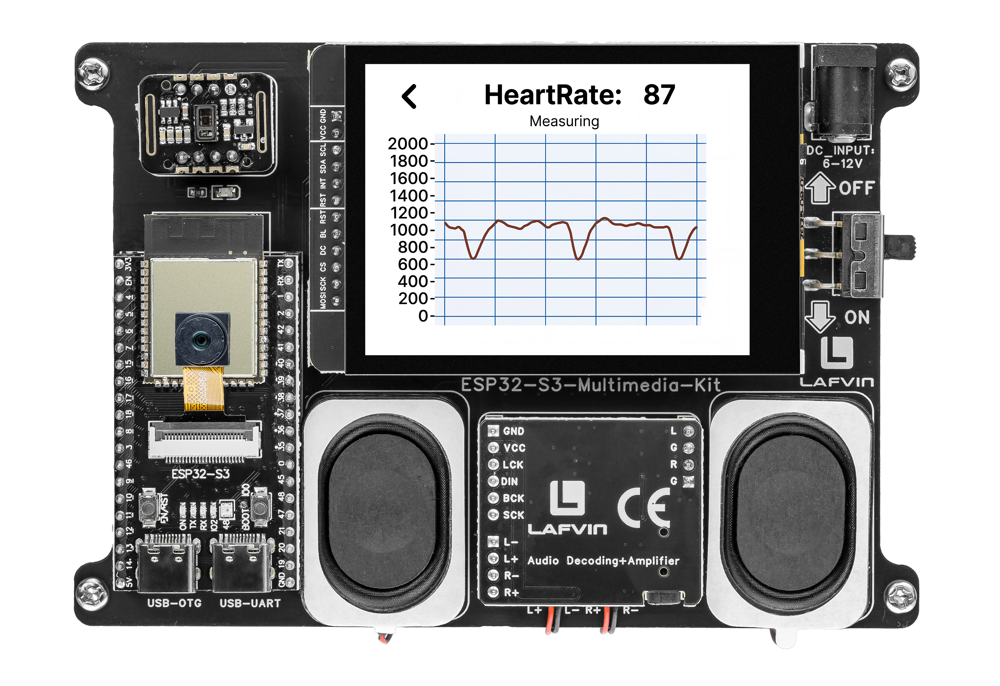

.. _lvgl_heartrate:

=====================================
2.10 Heart Rate Monitor with Chart
=====================================

Visualise your pulse as a real-time scrolling waveform on an LVGL chart.

Overview
========

This example creates a medical-style heart rate monitor. IR data from the MAX30102 sensor is plotted as a scrolling line chart, while the computed BPM is shown in a large text label — all updated in real time.

What You'll Learn
=================

* Creating and configuring an LVGL chart widget (``lv_chart``)
* Adding data series to a scrolling line graph
* Visualising real-time sensor data
* Displaying computed values (BPM) alongside the waveform

Setup Notes
===========

Make sure you have already completed:

* :ref:`driver_install`
* :ref:`environment_setup`

Open the example sketch from the code package:

``LAFVIN-ESP32-S3-Multimedia-Kit-main/2.LVGL/10_LVGL_Heartrate/10_LVGL_Heartrate.ino``

This example uses the **onboard** MAX30102 sensor. No external wiring is required.

======== ========
Signal   ESP32-S3
======== ========
SDA      GPIO 2
SCL      GPIO 1
======== ========

Upload and Test
===============

#. Connect the board with a USB Type-C data cable.
#. Open ``10_LVGL_Heartrate.ino`` in Arduino IDE.
#. In the **Tools** menu, select ``ESP32S3 Dev Module`` as the board and choose the correct serial port.
#. Click **Upload**.
#. The screen shows:

   * A scrolling red line chart (90 data points)
   * A large BPM reading (e.g., "BPM: 72")
   * A status label — "Waiting..." or "Finger detected"

   Gently place your fingertip on the MAX30102 sensor. The chart begins scrolling and the BPM number updates after a few seconds. Keep your finger still for the most accurate reading.

How the Code Works
==================

**Chart Initialisation**

.. code-block:: cpp

   lv_obj_t *chart = lv_chart_create(lv_scr_act());
   lv_chart_set_type(chart, LV_CHART_TYPE_LINE);
   lv_chart_set_point_count(chart, 90);
   lv_chart_set_range(chart, LV_CHART_AXIS_PRIMARY_Y, 0, 2000);

   lv_chart_series_t *ser = lv_chart_add_series(chart,
       lv_palette_main(LV_PALETTE_RED),
       LV_CHART_AXIS_PRIMARY_Y);

**Real-Time Data Feed**

.. code-block:: cpp

   long irValue = particleSensor.getIR();
   lv_chart_set_next_value(chart, ser, irValue);
   lv_chart_refresh(chart);

**BPM Display**

.. code-block:: cpp

   lv_label_set_text_fmt(bpmLabel, "BPM: %d", averageBPM);

**Status Indicator**

.. code-block:: cpp

   if (irValue > FINGER_ON_THRESHOLD) {
       lv_label_set_text(statusLabel, "Finger detected");
   } else {
       lv_label_set_text(statusLabel, "Waiting...");
   }

In the provided sketch:

* The MAX30102 is initialised on the same I2C bus as the touch panel (SDA=2, SCL=1)
* The chart auto-scrolls — new data pushes old data to the left
* The Y-axis range of 0–2000 covers the typical IR reflection values

Try This Next
=============

* Open Arduino IDE's **Serial Plotter** alongside the screen to compare graphs
* Increase ``lv_chart_set_point_count()`` for a longer waveform history
* Change the chart from ``LV_CHART_TYPE_LINE`` to ``LV_CHART_TYPE_BAR``
