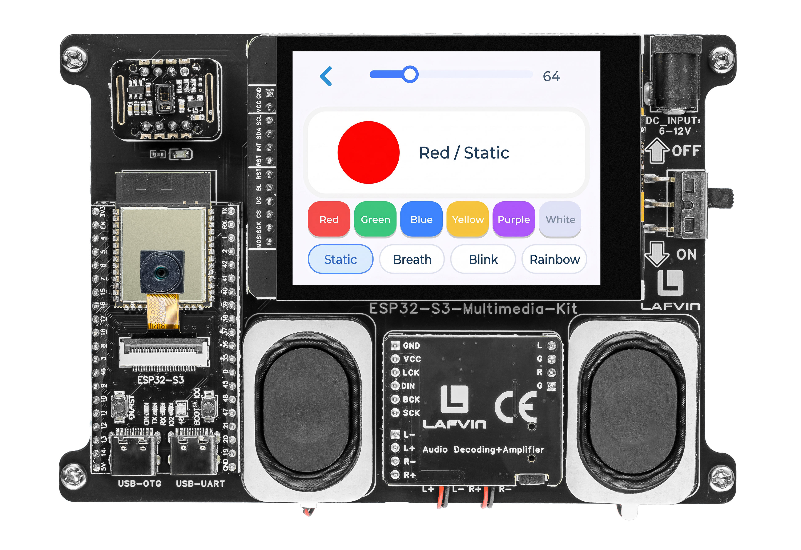

.. _lvgl_rgb:

==================================
2.11 RGB LED Control Panel
==================================

An advanced WS2812 LED controller with brightness, colour presets, and animation modes.

Overview
========

Building on the simpler switch/checkbox LED control from :ref:`lvgl_gpio`, this example creates a dedicated LED control panel. It adds a live colour preview, brightness slider, six colour preset buttons, and four animation modes — all updating the onboard WS2812 LED in real time.

What You'll Learn
=================

* Building a single-purpose control panel with multiple widgets
* Scaling RGB values proportionally for brightness control
* Implementing LED animation patterns (Static, blink, breath, rainbow)
* Using ``millis()``-based non-blocking timing for animations

Setup Notes
===========

Make sure you have already completed:

* :ref:`driver_install`
* :ref:`environment_setup`

Open the example sketch from the code package:

``LAFVIN-ESP32-S3-Multimedia-Kit-main/2.LVGL/11_LVGL_RGB/11_LVGL_RGB.ino``

======== ========
Signal   ESP32-S3
======== ========
LED DATA GPIO 48
======== ========

Upload and Test
===============

#. Connect the board with a USB Type-C data cable.
#. Open ``11_LVGL_RGB.ino`` in Arduino IDE.
#. In the **Tools** menu, select ``ESP32S3 Dev Module`` as the board and choose the correct serial port.
#. Click **Upload**.
#. The screen shows an LED control panel:

   * A circular colour preview panel
   * A brightness slider (0–255)
   * Six colour preset buttons: Red, Green, Blue, Yellow, Purple, White
   * Four animation mode buttons: **Static**, **Breath**, **Blink**, **Rainbow**

Tap a colour preset to see it on the preview panel and the physical LED. Drag the brightness slider to dim or brighten. Tap an animation mode to start an automatic sequence — tap **Static** to return to manual control.

How the Code Works
==================

The RGB control logic is mainly implemented in ``RGB_ui.cpp``.

**LED Brightness Control**

The ``write_led()`` function scales each RGB channel by the brightness value using 16-bit intermediate arithmetic to avoid overflow. The brightness slider (range 0–255) triggers a dirty flag on change rather than writing the LED directly.

.. code-block:: cpp

   void write_led(uint8_t r, uint8_t g, uint8_t b, uint8_t brightness) {
     const uint8_t r_scaled = static_cast<uint8_t>((static_cast<uint16_t>(r) * brightness) / 255);
     const uint8_t g_scaled = static_cast<uint8_t>((static_cast<uint16_t>(g) * brightness) / 255);
     const uint8_t b_scaled = static_cast<uint8_t>((static_cast<uint16_t>(b) * brightness) / 255);
     neopixelWrite(RGB_LED_PIN, r_scaled, g_scaled, b_scaled);
   }

   void brightness_slider_event_handler(lv_event_t *e) {
     if (lv_event_get_code(e) != LV_EVENT_VALUE_CHANGED) {
       return;
     }

     s_brightness = static_cast<uint8_t>(lv_slider_get_value(g_rgb_ui.brightness_slider));
     s_ui_dirty = true;
   }

**Colour Presets**

Six preset colours are defined in a ``RgbPreset`` struct array, each with a name, RGB value, and on-screen button colour. Tapping a preset stores the base colour and marks the UI as dirty, so the next refresh cycle applies it.

.. code-block:: cpp

   constexpr RgbPreset kPresets[] = {
     {"Red", 255, 0, 0, 0xF04E4E},
     {"Green", 0, 255, 0, 0x3CCB7F},
     {"Blue", 0, 110, 255, 0x3A86FF},
     {"Yellow", 255, 210, 0, 0xF4C542},
     {"Purple", 186, 85, 211, 0xA855F7},
     {"White", 255, 255, 255, 0xD9E1F2},
   };

   void preset_button_event_handler(lv_event_t *e) {
     if (lv_event_get_code(e) != LV_EVENT_CLICKED) {
       return;
     }

     const uintptr_t index = reinterpret_cast<uintptr_t>(lv_event_get_user_data(e));
     select_preset(static_cast<uint8_t>(index));
   }

   void select_preset(uint8_t index) {
     if (index >= 6) {
       return;
     }

     s_base_r = kPresets[index].r;
     s_base_g = kPresets[index].g;
     s_base_b = kPresets[index].b;
     s_ui_dirty = true;
   }

**Animation State Machine**

All four animation modes (Static, Breath, Blink, Rainbow) are driven by a single ``update_animation()`` function that uses ``millis()`` for non-blocking timing. Each mode has its own cadence and state.

.. code-block:: cpp

   void update_animation(void) {
     const uint32_t now = millis();

     switch (s_current_mode) {
       case RgbMode::Static:
         return;
       case RgbMode::Breath:
         if (now - s_last_anim_ms < 18) {
           return;
         }
         s_last_anim_ms = now;
         if (s_breath_direction > 0) {
           if (s_breath_level >= s_brightness) {
             s_breath_direction = -1;
           } else {
             s_breath_level = static_cast<uint8_t>(min(255, s_breath_level + 3));
           }
         } else {
           if (s_breath_level <= 8) {
             s_breath_direction = 1;
           } else {
             s_breath_level = static_cast<uint8_t>(s_breath_level - 3);
           }
         }
         s_ui_dirty = true;
         return;
       case RgbMode::Blink:
         if (now - s_last_anim_ms < 380) {
           return;
         }
         s_last_anim_ms = now;
         s_blink_on = !s_blink_on;
         s_ui_dirty = true;
         return;
       case RgbMode::Rainbow:
         if (now - s_last_anim_ms < 24) {
           return;
         }
         s_last_anim_ms = now;
         s_rainbow_hue += 2;
         s_ui_dirty = true;
         return;
     }
   }

Each mode sets ``s_ui_dirty = true`` when its state changes; the main loop calls ``refresh_ui()`` at 16 ms intervals to push updates to the LED and preview widget.

**Applying to the LED**

The ``apply_current_led()`` function routes the active mode's colour to ``write_led()``. The breath mode reuses the base colour scaled by the animated level; blink toggles between the base colour and off; rainbow converts the current HSV hue to RGB.

.. code-block:: cpp

   void apply_current_led(void) {
     switch (s_current_mode) {
       case RgbMode::Static:
         write_led(s_base_r, s_base_g, s_base_b, s_brightness);
         break;
       case RgbMode::Breath:
         write_led(s_base_r, s_base_g, s_base_b, s_breath_level);
         break;
       case RgbMode::Blink:
         if (s_blink_on) {
           write_led(s_base_r, s_base_g, s_base_b, s_brightness);
         } else {
           write_led(0, 0, 0, 0);
         }
         break;
       case RgbMode::Rainbow: {
         uint8_t r = 0;
         uint8_t g = 0;
         uint8_t b = 0;
         hsv_to_rgb(s_rainbow_hue, 255, 255, &r, &g, &b);
         write_led(r, g, b, s_brightness);
         break;
       }
     }
   }

In the provided sketch:

* ``current_preview_color()`` mirrors the LED state for the on-screen preview circle using the same mode dispatch logic
* The preview label shows both the colour name and mode name (e.g. ``"Red / Breath"``)
* ``refresh_ui()`` is rate-limited to ~60 Hz via ``kUiRefreshMs = 16``

Try This Next
=============

* Change the blink interval from 500ms to 100ms for a strobe effect
* Add your own animation mode (e.g., police lights or colour chase)
* Combine preset colours with the breathing animation for smoother transitions
