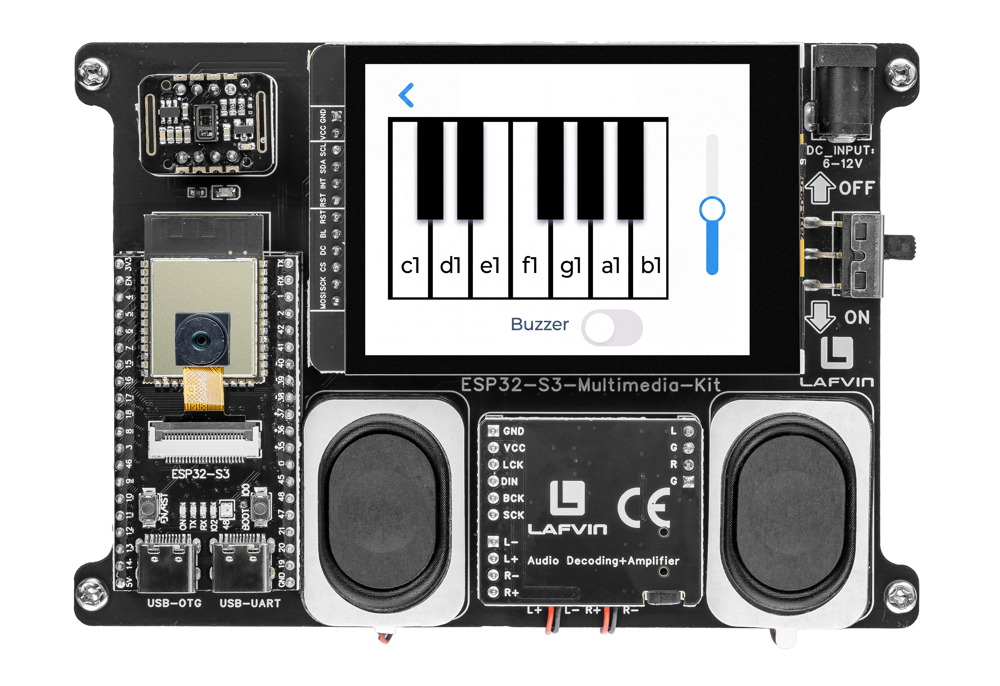

.. _lvgl_buzzer:

==============================
2.12 Piano Keyboard (Buzzer)
==============================

Play musical notes on an interactive one-octave piano keyboard displayed on the touchscreen.

Overview
========

This example creates an interactive piano keyboard with seven white keys and five black keys, arranged in a realistic layout. Each key plays a specific musical note through the passive buzzer using PWM frequencies. A volume slider and power switch round out the interface.

What You'll Learn
=================

* Designing a multi-button layout with overlapping widgets (black keys over white keys)
* Generating musical frequencies with ``ledcWriteTone()``
* Using a slider for volume control
* Building a power switch that enables or disables the entire keyboard

Before You Begin
================

Complete the setup steps in :ref:`preparation` before continuing.

.. note::
   Use the recommended Arduino IDE settings in :ref:`arduino_board_settings` unless this lesson says otherwise.

Open the example sketch from the code package:

``LAFVIN-ESP32-S3-Multimedia-Kit-main/2.LVGL/12_LVGL_Buzzer/12_LVGL_Buzzer.ino``

This example uses the **onboard** passive buzzer. No external wiring is required.

======== ========
Signal   ESP32-S3
======== ========
BUZZER   GPIO 45
======== ========

Upload and Test
===============

#. Connect the board with a USB Type-C data cable.
#. Open ``12_LVGL_Buzzer.ino`` in Arduino IDE.
#. In the **Tools** menu, select ``ESP32S3 Dev Module`` as the board and choose the correct serial port.
#. Click **Upload**.
#. The screen shows a one-octave piano keyboard (C4 to B4):

   * Seven **white keys** in a row at the bottom
   * Five **black keys** (C#, D#, F#, G#, A#) positioned between the white keys
   * A **volume slider** at the right
   * A **power switch** to enable or disable sound output

   Make sure the power switch is on, then tap any key. You should hear the corresponding musical note from the onboard buzzer. Drag the volume slider to adjust loudness.

How the Code Works
==================

The buzzer piano logic is mainly implemented in ``Buzzer_ui.cpp``.

**Note Frequencies**

Each piano key is defined by a ``PianoKey`` struct pairing a note name with its frequency in Hz. Seven white keys form a C4–B4 octave.

.. code-block:: cpp

   struct PianoKey {
     const char *name;
     uint16_t frequency;
   };

   constexpr PianoKey kPianoKeys[PIANO_KEY_COUNT] = {
     {"c1", 262},
     {"d1", 294},
     {"e1", 330},
     {"f1", 349},
     {"g1", 392},
     {"a1", 440},
     {"b1", 494},
   };

Five decorative black keys are rendered as overlapping ``lv_obj`` panels positioned between the white keys via a fixed ``kBlackKeyX[]`` coordinate array.

**Key Press & Release**

The ``key_event_handler()`` listens for three LVGL events: ``LV_EVENT_PRESSED`` starts the tone, while ``LV_EVENT_RELEASED`` and ``LV_EVENT_PRESS_LOST`` both stop it — this prevents stuck notes when a finger slides off the button.

.. code-block:: cpp

   void key_event_handler(lv_event_t *e) {
     const uint8_t key_index = static_cast<uint8_t>(reinterpret_cast<uintptr_t>(lv_event_get_user_data(e)));
     const lv_event_code_t code = lv_event_get_code(e);

     if (code == LV_EVENT_PRESSED) {
       s_active_key = static_cast<int8_t>(key_index);
       buzzer_play_frequency(kPianoKeys[key_index].frequency);
       return;
     }

     if (code == LV_EVENT_RELEASED || code == LV_EVENT_PRESS_LOST) {
       if (s_active_key == static_cast<int8_t>(key_index)) {
         s_active_key = -1;
         buzzer_stop_output();
       }
     }
   }

The ``buzzer_play_frequency()`` helper guards against three conditions — buzzer disabled, volume at zero, or frequency at zero — and stops output in any of those cases.

.. code-block:: cpp

   void buzzer_play_frequency(uint16_t frequency) {
     if (!s_buzzer_enabled || s_volume == 0 || frequency == 0) {
       buzzer_stop_output();
       return;
     }

     ledcWriteTone(BUZZER_PIN, frequency);
     ledcWrite(BUZZER_PIN, s_volume);
   }

**Volume & Power Switch**

The volume slider (range 0–255) updates the active key in real time — if a key is held down while the slider moves, the PWM duty adjusts immediately. The power switch toggles ``s_buzzer_enabled`` and stops output when turned off.

.. code-block:: cpp

   void volume_slider_event_handler(lv_event_t *e) {
     if (lv_event_get_code(e) != LV_EVENT_VALUE_CHANGED) {
       return;
     }

     s_volume = static_cast<uint8_t>(lv_slider_get_value(g_buzzer_ui.volume_slider));

     if (s_active_key >= 0) {
       buzzer_play_frequency(kPianoKeys[s_active_key].frequency);
     } else {
       buzzer_stop_output();
     }
   }

   void power_switch_event_handler(lv_event_t *e) {
     if (lv_event_get_code(e) != LV_EVENT_VALUE_CHANGED) {
       return;
     }

     s_buzzer_enabled = lv_obj_has_state(g_buzzer_ui.power_switch, LV_STATE_CHECKED);

     if (!s_buzzer_enabled || s_active_key < 0) {
       buzzer_stop_output();
       return;
     }

     buzzer_play_frequency(kPianoKeys[s_active_key].frequency);
   }

In the provided sketch:

* The PWM channel uses 8-bit resolution via ``ledcAttach(BUZZER_PIN, 1000, kPwmResolution)``
* Black keys are ``lv_obj`` panels with ``LV_OBJ_FLAG_CLICKABLE`` cleared — they are purely decorative
* ``LV_EVENT_ALL`` is used on key buttons to capture both press and release in one callback

Try This Next
=============

* Add a second octave (C5 to B5) for a wider range
* Record the notes you play and add a playback button
* Change the instrument sound by using a different waveform in PWM
