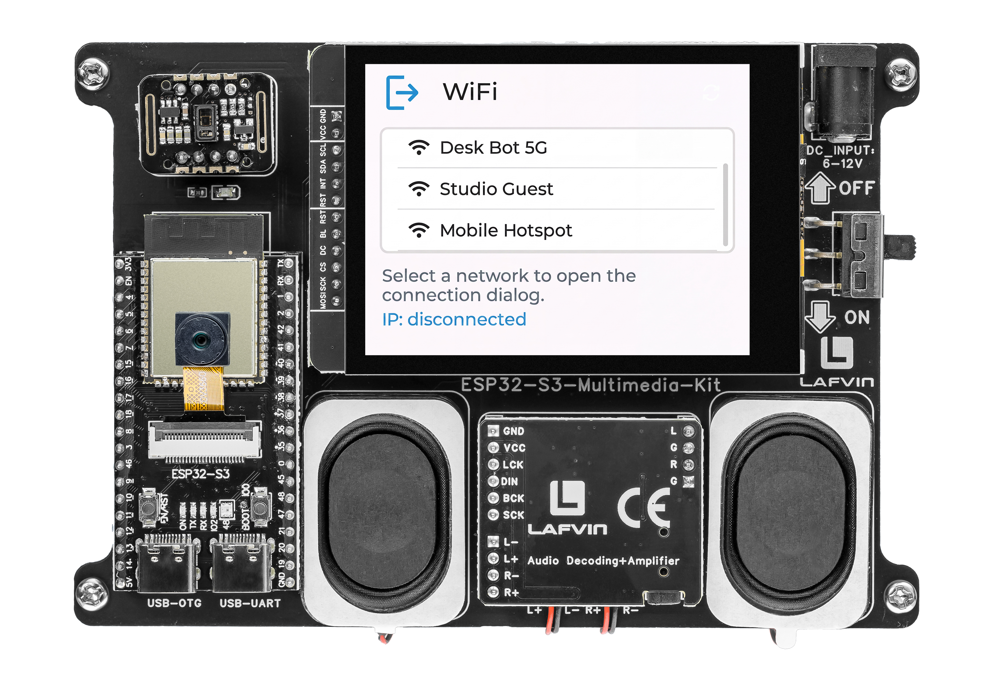

.. _lvgl_wifi:

====================================
2.13 WiFi Connection Manager
====================================

Scan for WiFi networks and connect using an on-screen keyboard for password entry.

Overview
========

This example builds a complete WiFi management UI. It scans for nearby networks, displays them in a scrollable list with signal strength, and provides an on-screen keyboard for entering passwords — all through the touchscreen.

What You'll Learn
=================

* Scanning WiFi networks with ``WiFi.scanNetworks()``
* Populating and refreshing an LVGL list widget
* Building a password dialog with ``lv_textarea`` and ``lv_keyboard``
* Displaying connection status and assigned IP address

Before You Begin
================

Complete the setup steps in :ref:`preparation` before continuing.

.. note::
   Use the recommended Arduino IDE settings in :ref:`arduino_board_settings` unless this lesson says otherwise.

Open the example sketch from the code package:

``LAFVIN-ESP32-S3-Multimedia-Kit-main/2.LVGL/13_LVGL_WIFI/13_LVGL_WIFI.ino``

Upload and Test
===============

#. Connect the board with a USB Type-C data cable.
#. Open ``13_LVGL_WIFI.ino`` in Arduino IDE.
#. In the **Tools** menu, select ``ESP32S3 Dev Module`` as the board and choose the correct serial port.
#. Click **Upload**.
#. After uploading, the screen shows:

   * A **"Scan"** button — tap it to search for nearby WiFi networks
   * A scrollable list of detected networks, each showing the SSID and signal strength indicator
   * A status label at the bottom ("Disconnected" or "Connected")

   Tap any network in the list. A dialog appears with:

   * The network name (SSID) displayed at the top
   * A text area for the password
   * An on-screen keyboard to type the password
   * **Back** and **Join** buttons

   Enter the password and tap **Join**. The status label updates to show the connection progress and, if successful, the assigned IP address.

How the Code Works
==================

The WiFi manager logic is mainly implemented in ``Wifi_ui.cpp``.

**Network Scanning**

The ``scan_networks()`` function sets the ESP32 to station mode, disconnects any previous session, and calls ``WiFi.scanNetworks()`` with hidden SSID scanning enabled. Results are capped at 12 entries and stored in fixed-size arrays.

.. code-block:: cpp

   void scan_networks(void) {
     set_status_text("Status: Scanning nearby WiFi...");
     set_ip_text("IP: --");

     WiFi.mode(WIFI_STA);
     WiFi.disconnect();
     delay(50);

     const int found = WiFi.scanNetworks(false, true);
     s_scan_count = 0;

     if (found <= 0) {
       rebuild_wifi_list();
       set_status_text("Status: No WiFi found");
       return;
     }

     const int limited_count = (found > kMaxScanResults) ? kMaxScanResults : found;
     for (int i = 0; i < limited_count; ++i) {
       const String ssid = WiFi.SSID(i);
       ssid.toCharArray(s_scanned_ssids[i], sizeof(s_scanned_ssids[i]));
       s_scanned_rssi[i] = WiFi.RSSI(i);
       s_scan_count++;
     }

     WiFi.scanDelete();
     rebuild_wifi_list();

     char buffer[64];
     snprintf(buffer, sizeof(buffer), "Status: Found %u network(s)", static_cast<unsigned>(s_scan_count));
     set_status_text(buffer);
   }

**Rebuilding the List**

The ``rebuild_wifi_list()`` function clears the list widget and populates it with buttons — each showing the SSID and RSSI value. An event callback is attached to each button with the array index as user data, so a tap opens the password dialog for the correct network.

.. code-block:: cpp

   void rebuild_wifi_list(void) {
     lv_obj_clean(g_wifi_ui.wifi_list);

     if (s_scan_count == 0) {
       lv_obj_t *label = lv_label_create(g_wifi_ui.wifi_list);
       lv_label_set_text(label, "No WiFi found. Tap refresh to scan again.");
       return;
     }

     for (uint8_t i = 0; i < s_scan_count; ++i) {
       lv_obj_t *btn = lv_list_add_btn(g_wifi_ui.wifi_list, LV_SYMBOL_WIFI, s_scanned_ssids[i]);
       lv_obj_add_event_cb(
         btn,
         wifi_item_event_handler,
         LV_EVENT_CLICKED,
         reinterpret_cast<void *>(static_cast<uintptr_t>(i)));

       lv_obj_t *btn_label = lv_obj_get_child(btn, 1);
       if (btn_label != nullptr) {
         lv_label_set_text_fmt(btn_label, "%s  (%d dBm)", s_scanned_ssids[i], static_cast<int>(s_scanned_rssi[i]));
       }
     }
   }

**Password Dialog with On-Screen Keyboard**

The dialog is built from a single-line password text area and an LVGL keyboard in lowercase text mode. The keyboard's ``LV_EVENT_READY`` auto-triggers connection, while ``LV_EVENT_CANCEL`` hides the dialog.

.. code-block:: cpp

     ui->password_area = lv_textarea_create(ui->dialog);
     lv_textarea_set_one_line(ui->password_area, true);
     lv_textarea_set_password_mode(ui->password_area, true);
     lv_textarea_set_placeholder_text(ui->password_area, "Enter password");

     ui->keyboard = lv_keyboard_create(ui->overlay);
     lv_keyboard_set_mode(ui->keyboard, LV_KEYBOARD_MODE_TEXT_LOWER);
     lv_keyboard_set_popovers(ui->keyboard, false);
     lv_keyboard_set_textarea(ui->keyboard, ui->password_area);
     lv_obj_add_event_cb(ui->keyboard, keyboard_event_handler, LV_EVENT_ALL, nullptr);

**Connection Handling**

The ``start_connection()`` function reads the password from the text area and calls ``WiFi.begin()``. The ``wifi_ui_loop()`` polls ``WiFi.status()`` each frame — it detects success (``WL_CONNECTED``) and three failure conditions: timeout, ``WL_CONNECT_FAILED``, and ``WL_NO_SSID_AVAIL``.

.. code-block:: cpp

   void start_connection(void) {
     hide_password_dialog();

     const char *password = lv_textarea_get_text(g_wifi_ui.password_area);
     WiFi.disconnect();
     WiFi.begin(s_selected_ssid, password);

     s_connecting = true;
     s_connect_started_ms = millis();

     char buffer[96];
     snprintf(buffer, sizeof(buffer), "Status: Connecting to %s ...", s_selected_ssid);
     set_status_text(buffer);
     set_ip_text("IP: --");
   }

   void wifi_ui_loop(void) {
     if (!s_connecting) {
       return;
     }

     const wl_status_t status = WiFi.status();
     if (status == WL_CONNECTED) {
       s_connecting = false;
       char status_buffer[96];
       snprintf(status_buffer, sizeof(status_buffer), "Status: Connected to %s", s_selected_ssid);
       set_status_text(status_buffer);

       const String ip = WiFi.localIP().toString();
       char ip_buffer[64];
       snprintf(ip_buffer, sizeof(ip_buffer), "IP: %s", ip.c_str());
       set_ip_text(ip_buffer);
       return;
     }

     if (millis() - s_connect_started_ms >= kConnectTimeoutMs ||
         status == WL_CONNECT_FAILED ||
         status == WL_NO_SSID_AVAIL) {
       s_connecting = false;
       set_status_text("Status: Connection failed");
       set_ip_text("IP: --");
       WiFi.disconnect();
     }
   }

In the provided sketch:

* Up to 12 scan results (``kMaxScanResults``) are stored in ``s_scanned_ssids`` and ``s_scanned_rssi`` arrays
* ``lv_textarea_set_password_mode()`` hides the typed characters; ``set_one_line()`` keeps the input compact
* A 15-second timeout (``kConnectTimeoutMs``) combined with immediate failure status checks prevents the UI from hanging
* The refresh button calls ``scan_networks()`` again to update the list

Try This Next
=============

* Save the SSID and password to preferences so you don't need to re-enter them
* Add a signal strength icon (bars) next to each network name
* Display the MAC address and RSSI in the connection details
