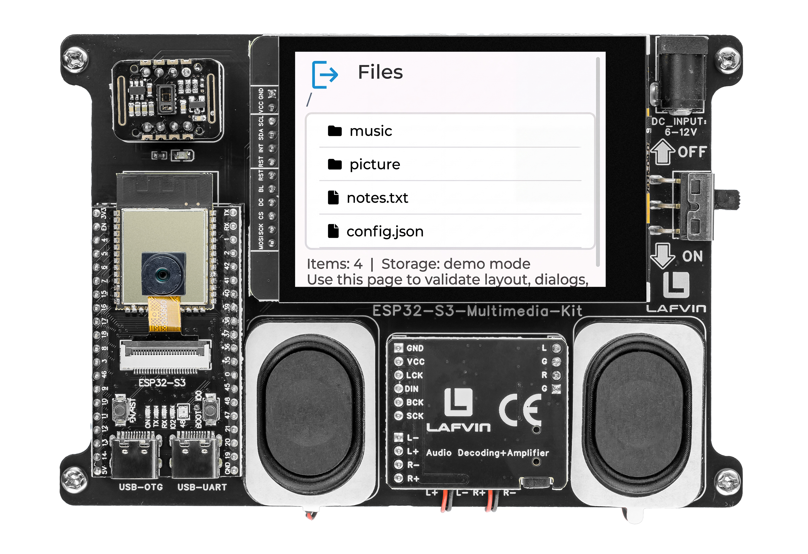

.. _lvgl_filemanager:

=================================
2.14 SD Card File Manager
=================================

Browse, navigate, and manage files on the SD card through a graphical file explorer.

Overview
========

This example creates a complete file manager for the SD card. You can browse folders, view file details (name, size), delete files, and navigate through the directory tree — all from the touchscreen, no computer needed.

What You'll Learn
=================

* Building a file system explorer with the LVGL list widget
* Implementing directory navigation with a breadcrumb path display
* Displaying file metadata
* Creating confirmation dialogs for destructive actions (file deletion)

Setup Notes
===========

Make sure you have already completed:

* :ref:`driver_install`
* :ref:`environment_setup`

Open the example sketch from the code package:

``LAFVIN-ESP32-S3-Multimedia-Kit-main/2.LVGL/14_LVGL_File_Manager/14_LVGL_File_Manager.ino``

.. note::
   You need a Micro SD card formatted as **FAT32** inserted. The SD card from :ref:`arduino_sdmmc` with test files will work perfectly.

Upload and Test
===============

#. Insert a FAT32-formatted Micro SD card.
#. Connect the board with a USB Type-C data cable.
#. Open ``14_LVGL_File_Manager.ino`` in Arduino IDE.
#. In the **Tools** menu, select ``ESP32S3 Dev Module`` as the board and choose the correct serial port.
#. Click **Upload**.
#. After uploading, the screen shows:

   * A path breadcrumb at the top (e.g., ``/music/albums/``)
   * A scrollable list of files and folders
   * Folders are shown with a directory icon — tap to enter them
   * Files are shown with a file icon — tap to see details

   Tapping a file opens a dialog with its name and size. A **Delete** button lets you remove the file (with a confirmation prompt). Tap the current path or a parent folder to navigate back up the tree.

How the Code Works
==================

**Directory Navigation**

.. code-block:: cpp

   static void navigateTo(const char *path) {
       File dir = SD_MMC.open(path);
       lv_obj_clean(fileList);          // Clear current listing

       File entry = dir.openNextFile();
       while (entry) {
           lv_obj_t *btn;
           if (entry.isDirectory()) {
               btn = lv_list_add_btn(fileList,
                   LV_SYMBOL_DIRECTORY, entry.name());
           } else {
               btn = lv_list_add_btn(fileList,
                   LV_SYMBOL_FILE, entry.name());
           }
           lv_obj_add_event_cb(btn, entryCb,
               LV_EVENT_CLICKED, strdup(entry.path()));
           entry = dir.openNextFile();
       }
   }

**File Details and Deletion**

.. code-block:: cpp

   static void showFileDialog(const char *path) {
       File f = SD_MMC.open(path);
       size_t size = f.size();
       f.close();

       // Create dialog overlay with file name, size, and Delete button
       lv_label_set_text_fmt(sizeLabel, "Size: %u bytes", size);

       // Delete button callback
       SD_MMC.remove(path);
       navigateTo(currentPath);  // Refresh listing
   }

**WiFi Status Badge**

A small icon in the header shows whether the board is currently connected to a Wi-Fi network.

In the provided sketch:

* Navigation is recursive — each folder tap calls ``navigateTo()`` with the new path
* The current path is updated and displayed as a breadcrumb
* File deletion includes a confirmation step to prevent accidental removal

Try This Next
=============

* Add a "New Folder" button to create directories from the touchscreen
* Display file modification dates alongside sizes
* Add drag-to-scroll for long file lists
