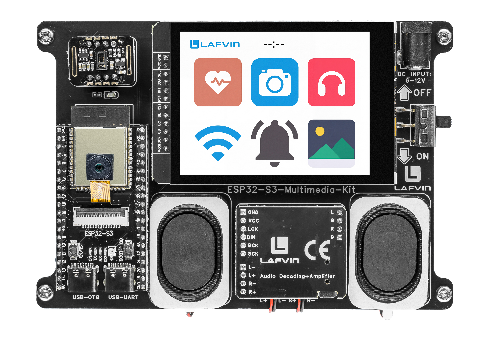

.. _lvgl_allinone:

===============================
2.15 All-In-One Application
===============================

The capstone project: a smartphone-style app launcher that integrates every peripheral and UI module.

Overview
========

This is the ultimate project that ties together everything you have built. It creates a home screen with two pages of app icons, each launching one of the previous projects: Camera, Gallery, Music, HeartRate, RGB, Buzzer, WiFi, and File Manager. It includes a status bar with WiFi indicator and real-time clock.

What You'll Learn
=================

* Building an app launcher with LVGL tileview and paginated screens
* Lazy-loading: initialising modules only when first launched
* Managing screen transitions and properly stopping background tasks
* NTP time synchronisation for a live clock
* Structuring a large, multi-module embedded application

Before You Begin
================

Complete the setup steps in :ref:`preparation` before continuing.

.. note::
   Use the recommended Arduino IDE settings in :ref:`arduino_board_settings` unless this lesson says otherwise.

Open the example sketch from the code package:

``LAFVIN-ESP32-S3-Multimedia-Kit-main/2.LVGL/15_LVGL_All_In_One/15_LVGL_All_In_One.ino``

.. note::
   This sketch uses all board peripherals. You need a Micro SD card with the proper folder structure for Gallery, Music, and Camera.

Upload and Test
===============

#. Insert a FAT32-formatted Micro SD card (with ``/music/`` and ``/picture/`` folders if you want to use those apps).
#. Connect the board with a USB Type-C data cable.
#. Open ``15_LVGL_All_In_One.ino`` in Arduino IDE.
#. In the **Tools** menu, select ``ESP32S3 Dev Module`` as the board and choose the correct serial port.
#. Click **Upload**.
#. After uploading, the home screen shows:

   * **Status bar** at the top with Wi-Fi icon and current time
   * Two tile pages (swipe left/right to switch):

     - **Page 1**: HeartRate, Camera, Music, WiFi, Buzzer, Gallery
     - **Page 2**: RGB, File Manager

   Tap any app icon to launch the full application, identical to the standalone version you built in the earlier lessons. Tap the back/home button to return to the launcher.

How the Code Works
==================

The launcher UI logic is mainly implemented in ``LAFVIN-ESP32-S3-Multimedia-Kit-main/2.LVGL/15_LVGL_All_In_One/home_ui.cpp`` and ``LAFVIN-ESP32-S3-Multimedia-Kit-main/2.LVGL/15_LVGL_All_In_One/all_in_one_app.cpp``.

**Launcher Targets**

The first home page defines six app targets. These enum values are later used when creating the icon buttons.

.. code-block:: cpp

   const AppScreen kPageOneTargets[6] = {
     APP_SCREEN_HEARTRATE,
     APP_SCREEN_CAMERA,
     APP_SCREEN_MUSIC,
     APP_SCREEN_WIFI,
     APP_SCREEN_BUZZER,
     APP_SCREEN_GALLERY,
   };

These targets are used to build the launcher page and decide which full app to open after a tap.

**Page Switching**

The tileview callback tracks which launcher page is currently active. This lets the home screen return to the same page after leaving an app.

.. code-block:: cpp

   void tileview_event_handler(lv_event_t *e) {
     if (lv_event_get_code(e) != LV_EVENT_VALUE_CHANGED) {
       return;
     }

     // Store the active page so returning from a child module restores the same page.
     lv_obj_t *active_tile = lv_tileview_get_tile_act(g_home_ui.tileview);
     if (active_tile == g_home_ui.page_two) {
       s_current_page = 1;
     } else {
       s_current_page = 0;
     }

     all_in_one_set_home_page(s_current_page);
   }

**Opening an App**

When the user taps an icon, the launcher opens the selected module. The camera branch below shows the lazy-loading pattern used in this project.

.. code-block:: cpp

   void all_in_one_open_screen(AppScreen screen) {
     ensure_home_ready();

     // Treat a request for HOME as a normal back-to-home action.
     if (screen == APP_SCREEN_HOME) {
       all_in_one_show_home();
       return;
     }

     // Stop the currently active module before opening another one.
     before_switch_from(s_current_screen);

     switch (screen) {
       case APP_SCREEN_CAMERA:
         ensure_sd_ready();
         ensure_camera_ready();
         if (!s_camera_initialized) {
           all_in_one_show_home();
           return;
         }
         if (!s_camera_ready) {
           camera_ui_setup(&g_camera_ui);
           s_camera_ready = true;
         }
         camera_task_start();
         break;

This pattern is repeated for Gallery, Music, HeartRate, RGB, Buzzer, WiFi, and File Manager, with each module initialized only when it is needed.

**Stopping Background Tasks**

Before switching screens, the app stops any background tasks that should not keep running.

.. code-block:: cpp

   void before_switch_from(AppScreen screen) {
     // Stop hardware or timing loops that should not keep running in the background.
     if (screen == APP_SCREEN_CAMERA && camera_task_is_running()) {
       camera_task_stop();
     }
     if (screen == APP_SCREEN_HEARTRATE) {
       hartrate_ui_stop();
     }
     if (screen == APP_SCREEN_MUSIC) {
       music_ui_stop();
     }
     if (screen == APP_SCREEN_RGB) {
       rgb_ui_stop();
     }
   }

This prevents the previous module from continuing to use CPU time or hardware resources after the user leaves it.

**Wi-Fi Starts NTP**

After Wi-Fi connects successfully, the project enables NTP time synchronization for the status bar clock.

.. code-block:: cpp

   void all_in_one_notify_wifi_connected(void) {
     if (s_ntp_requested) {
       return;
     }

     // Use China Standard Time and start NTP once WiFi is confirmed.
     setenv("TZ", "CST-8", 1);
     tzset();
     configTime(8 * 3600, 0, "ntp.aliyun.com", "pool.ntp.org");
     s_ntp_requested = true;
     s_ntp_synced = false;
     s_last_clock_refresh_ms = 0;
   }

**Refreshing the Clock**

The launcher updates the clock once per second and shows ``--:--`` until NTP time becomes valid.

.. code-block:: cpp

   void refresh_clock_label(void) {
     // Update the clock at a steady 1 Hz pace to avoid unnecessary redraws.
     if (millis() - s_last_clock_refresh_ms < 1000) {
       return;
     }
     s_last_clock_refresh_ms = millis();

     if (!s_ntp_requested) {
       home_ui_set_time_text("--:--");
       return;
     }

     time_t now = time(nullptr);
     if (now < 100000) {
       home_ui_set_time_text("--:--");
       return;
     }

     s_ntp_synced = true;

     struct tm time_info;
     localtime_r(&now, &time_info);
     char buffer[6];
     strftime(buffer, sizeof(buffer), "%H:%M", &time_info);
     home_ui_set_time_text(buffer);
   }

In the provided sketch:

* Each module is initialised only when first tapped, saving memory and startup time
* The tileview fires ``LV_EVENT_VALUE_CHANGED`` when the user swipes pages, which updates ``s_current_page``
* ``screen_for()`` maps each ``AppScreen`` enum value to the actual LVGL screen object
* NTP time sync uses China Standard Time (CST-8) with ``ntp.aliyun.com`` as the primary server

Try This Next
=============

* Add a third page with utility apps (settings, about, help)
* Customise app icons with your own images
* Add a battery indicator to the status bar using ADC readings from :ref:`arduino_adc`
* Create your own custom app and add it to the launcher
