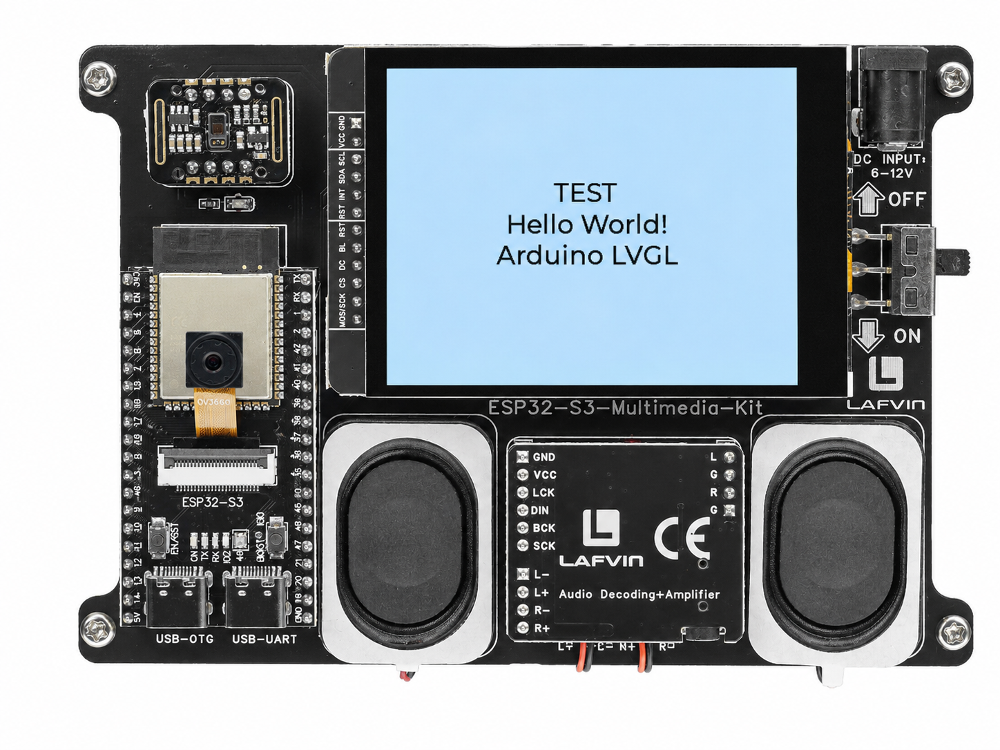

.. _lvgl_hello:

======================
2.1 LVGL Hello World
======================

Verify that LVGL, the display, and the touch panel are all working with a minimal test screen.

Overview
========

This is the simplest possible LVGL application — a single centred text label. It confirms that the TFT display is rendering, LVGL's task handler is running, and the touch panel is detected.

What You'll Learn
=================

* How the shared ``Display`` class initialises the hardware (display + touch + LVGL)
* The minimum ``setup()`` and ``loop()`` structure for every LVGL project
* Creating and centring a label widget

Before You Begin
================

Complete the setup steps in :ref:`preparation` before continuing.

.. note::
   Use the recommended Arduino IDE settings in :ref:`arduino_board_settings` unless this lesson says otherwise.

Open the example sketch from the code package:

``LAFVIN-ESP32-S3-Multimedia-Kit-main/2.LVGL/01_LVGL_Test/01_LVGL_Test.ino``

Upload and Test
===============

#. Connect the board with a USB Type-C data cable.
#. Open ``01_LVGL_Test.ino`` in Arduino IDE.
#. In the **Tools** menu, select ``ESP32S3 Dev Module`` as the board and choose the correct serial port.
#. Click **Upload**.
#. After uploading, the TFT screen shows **"TEST"** followed by **"Hello World!"** and **"Arduino LVGL"**, all centred on a white background.

If the screen stays blank, check that the **TFT_eSPI** library has been configured for this board's display pins (see :ref:`install_local_library`).

How the Code Works
==================

This minimal sketch is self-contained in ``01_LVGL_Test.ino``.

**The Display Class**

Every LVGL project in this kit shares the same ``Display`` class (found in ``display.h`` and ``display.cpp``). It handles:

* **FT6336U** touch controller initialisation (I2C: SDA=2, SCL=1)
* **TFT_eSPI** display driver initialisation (SPI, landscape 320×240)
* **LVGL** core initialisation (``lv_init()``, display driver, input device driver)

.. code-block:: cpp

   #include "display.h"

   Display screen;

   void setup() {
       Serial.begin(115200);
       screen.init();  // Hardware + LVGL ready

       // Add your widgets here...
   }

   void loop() {
       screen.routine();  // Calls lv_timer_handler() at ~200Hz
       delay(5);
   }

**The Label Widget**

The sketch sets a white background, creates a centred label with three lines of text, and applies a ``montserrat_20`` font style with centre alignment.

.. code-block:: cpp

     lv_obj_set_style_bg_color(lv_scr_act(), lv_color_white(), 0);
     lv_obj_set_style_bg_opa(lv_scr_act(), LV_OPA_COVER, 0);

     lv_obj_t *label = lv_label_create(lv_scr_act());
     lv_label_set_text(label, "TEST\nHello World!\nArduino LVGL");
     lv_obj_align(label, LV_ALIGN_CENTER, 0, 0);

     static lv_style_t style;
     lv_style_init(&style);
     lv_style_set_text_font(&style, &lv_font_montserrat_20);
     lv_style_set_text_align(&style, LV_TEXT_ALIGN_CENTER);
     lv_obj_add_style(label, &style, 0);

In the provided sketch:

* ``lv_scr_act()`` returns the currently active screen — the starting point for every widget
* ``lv_obj_align()`` with ``LV_ALIGN_CENTER`` centres the label within the screen
* The font must be enabled in ``lv_conf.h`` — ``montserrat_20`` is enabled by default in this kit's configuration

Try This Next
=============

* Change the text to your own message
* Add ``lv_obj_set_style_text_color(label, lv_palette_main(LV_PALETTE_RED), 0);`` to change the text colour
