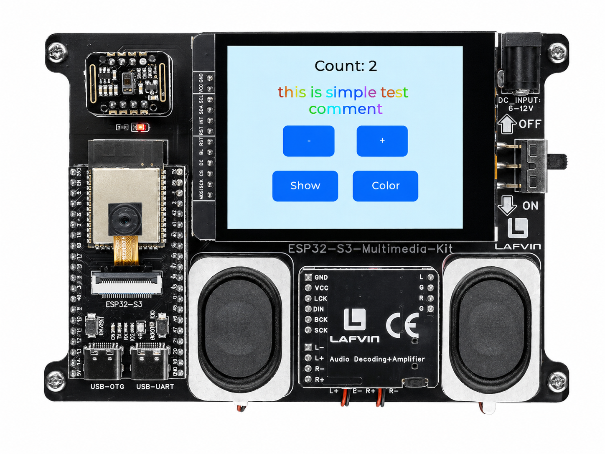

.. _lvgl_label:

===================================
2.2 Label and Button Controls
===================================

Build an interactive UI with clickable buttons and a dynamic counter label.

Overview
========

This example introduces interactive widgets. You will create a counter controlled by plus and minus buttons, plus "Show" and "Color" buttons that demonstrate LVGL's text formatting features — including inline colour codes.

What You'll Learn
=================

* Creating and configuring buttons (``lv_btn``)
* Attaching event callbacks to respond to touch
* Updating label text at runtime with ``lv_label_set_text_fmt()``
* Using LVGL text recolouring (``#FF0000 text#`` syntax)

Before You Begin
================

Complete the setup steps in :ref:`preparation` before continuing.

.. note::
   Use the recommended Arduino IDE settings in :ref:`arduino_board_settings` unless this lesson says otherwise.

Open the example sketch from the code package:

``LAFVIN-ESP32-S3-Multimedia-Kit-main/2.LVGL/02_LVGL_Lable/02_LVGL_Lable.ino``

Upload and Test
===============

#. Connect the board with a USB Type-C data cable.
#. Open ``02_LVGL_Lable.ino`` in Arduino IDE.
#. In the **Tools** menu, select ``ESP32S3 Dev Module`` as the board and choose the correct serial port.
#. Click **Upload**.
#. After uploading, the screen shows:

   * A counter label (e.g., "Count: 0") with **+** and **-** buttons
   * A **"Show"** button — tap it to display a plain text message
   * A **"Color"** button — tap it to display rainbow-coloured text

How the Code Works
==================

The demo is self-contained in ``02_LVGL_Lable.ino``.

**Shared Event Handler**

All four buttons share a single ``event_handler()`` callback. Each button passes a unique integer ID as user data (``1`` for increment, ``-1`` for decrement, ``2`` for Show, ``3`` for Color). The callback switches on this ID to determine the action.

.. code-block:: cpp

   static void event_handler(lv_event_t * e) {
     lv_event_code_t code = lv_event_get_code(e);

     if(code == LV_EVENT_CLICKED) {
       intptr_t btn_id = (intptr_t)lv_event_get_user_data(e);

       switch (btn_id) {
         case 1: // Count +
           count_val++;
           lv_label_set_text_fmt(label_count, "Count: %d", count_val);
           break;

         case -1: // Count -
           count_val--;
           lv_label_set_text_fmt(label_count, "Count: %d", count_val);
           break;

         case 2: // Show Black Text
           lv_label_set_recolor(label_comment, false);
           lv_label_set_text(label_comment, "this is simple test comment");
           lv_obj_set_style_text_color(label_comment, lv_color_black(), 0);
           break;

         case 3: // Show Colorful Text
           lv_label_set_recolor(label_comment, true);
           lv_label_set_text(label_comment, colored_text);
           break;
       }
     }
   }

Buttons are created with the ID passed as the last argument to ``lv_obj_add_event_cb()``:

.. code-block:: cpp

     lv_obj_add_event_cb(btn_plus, event_handler, LV_EVENT_CLICKED, (void*)1);
     lv_obj_add_event_cb(btn_minus, event_handler, LV_EVENT_CLICKED, (void*)-1);
     lv_obj_add_event_cb(btn_show, event_handler, LV_EVENT_CLICKED, (void*)2);
     lv_obj_add_event_cb(btn_color, event_handler, LV_EVENT_CLICKED, (void*)3);

**Text Recolouring**

LVGL supports inline colour formatting with the ``#RRGGBB text#`` syntax. The sketch defines a long ``colored_text`` constant that spells out *"this is simple test comment"* with each character in a different hue. The Color button enables recolouring mode and sets this string; the Show button disables it and reverts to plain black text.

.. code-block:: cpp

   const char * colored_text =
       "#FF0000 t##FF8000 h##FFFF00 i##80FF00 s# "
       "#00FF00 i##00FF80 s# "
       "#00FFFF s##0080FF i##0000FF m##8000FF p##FF00FF l##FF0080 e# "
       "#FF0000 t##FF8000 e##FFFF00 s##80FF00 t# "
       "#00FF00 c##00FF80 o##00FFFF m##0080FF m##0000FF e##8000FF n##FF00FF t#";

The counter label uses ``lv_label_set_text_fmt()`` for formatted integer display, while the comment label uses ``lv_label_set_long_mode(LV_LABEL_LONG_WRAP)`` with a fixed width of 220 px to allow automatic line wrapping.

In the provided sketch:

* ``count_val`` is a static global, initialised to ``0``
* The four buttons are arranged: plus/minus centred in the upper half, Show/Color in the lower half
* ``lv_label_set_recolor(label_comment, true)`` must be called before the ``#RRGGBB`` codes are interpreted

Try This Next
=============

* Add a reset button that sets the counter back to 0
* Experiment with more colour codes: ``#0000FF``, ``#FF00FF``, ``#00FFFF``
* Use ``lv_label_set_long_mode()`` to see how long text wraps
