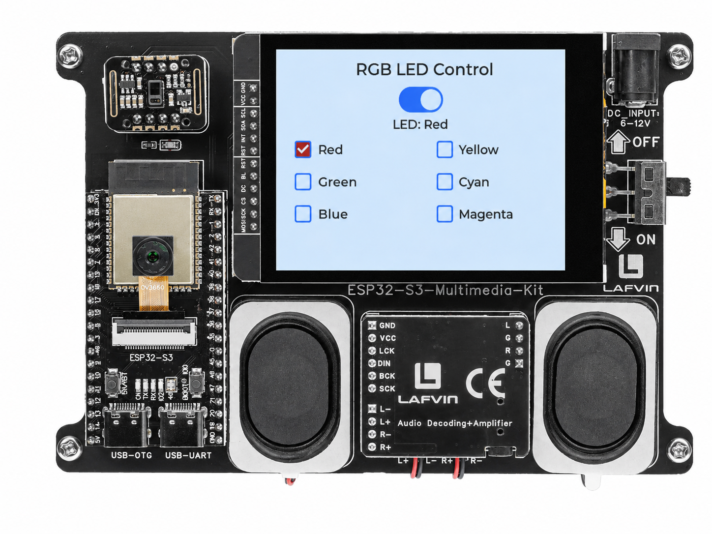

.. _lvgl_gpio:

==========================================
2.3 Switch and Checkbox — RGB LED Control
==========================================

Control the onboard WS2812 LED with LVGL switch and checkbox widgets.

Overview
========

This is the first LVGL project where the touchscreen directly controls physical hardware. A **Switch** toggles the LED on and off, and six **Checkboxes** (radio-button style) select the LED's colour.

What You'll Learn
=================

* Creating switches (``lv_switch``) and checkboxes (``lv_checkbox``)
* Implementing single-selection radio-button behaviour
* Linking LVGL events to hardware control (``neopixelWrite()``)
* Styling checkbox indicators with custom colours

Before You Begin
================

Complete the setup steps in :ref:`preparation` before continuing.

.. note::
   Use the recommended Arduino IDE settings in :ref:`arduino_board_settings` unless this lesson says otherwise.

Open the example sketch from the code package:

``LAFVIN-ESP32-S3-Multimedia-Kit-main/2.LVGL/03_LVGL_GPIO/03_LVGL_GPIO.ino``

======== ========
Signal   ESP32-S3
======== ========
LED DATA GPIO 48
======== ========

Upload and Test
===============

#. Connect the board with a USB Type-C data cable.
#. Open ``03_LVGL_GPIO.ino`` in Arduino IDE.
#. In the **Tools** menu, select ``ESP32S3 Dev Module`` as the board and choose the correct serial port.
#. Click **Upload**.
#. On the screen you see:

   * A master **Switch** — toggle it to turn the LED on or off
   * Six colour checkboxes: Red, Green, Blue, Yellow, Cyan, Magenta
   * A status label showing the current LED state

   Flip the master switch on, then tap any colour checkbox. The onboard WS2812 LED changes colour immediately. Only one colour can be selected at a time — tapping a new one deselects the previous.

How the Code Works
==================

The demo is self-contained in ``03_LVGL_GPIO.ino``.

**LED Control Helper**

A ``ledWrite()`` function scales each RGB channel by a global ``BRIGHTNESS`` factor (set to 25 to avoid dazzling) and calls ``neopixelWrite()`` to update the onboard WS2812. The ``updateLED()`` function reads the master switch state and either applies the selected colour or turns the LED off, updating the status label accordingly.

.. code-block:: cpp

   void ledWrite(uint8_t r, uint8_t g, uint8_t b) {
     uint8_t r_scaled = (r * BRIGHTNESS) / 255;
     uint8_t g_scaled = (g * BRIGHTNESS) / 255;
     uint8_t b_scaled = (b * BRIGHTNESS) / 255;

     neopixelWrite(LED_PIN, r_scaled, g_scaled, b_scaled);
   }

   void updateLED() {
     bool is_on = lv_obj_has_state(main_switch, LV_STATE_CHECKED);

     if(is_on) {
       ledWrite(colors[selected_color].r,
                colors[selected_color].g,
                colors[selected_color].b);
       lv_label_set_text_fmt(label_status, "LED: %s", colors[selected_color].name);
     } else {
       ledWrite(0, 0, 0);
       lv_label_set_text(label_status, "LED: OFF");
     }
   }

**Master Switch**

The switch listens for ``LV_EVENT_VALUE_CHANGED`` and calls ``updateLED()`` on every toggle. The ``lv_obj_has_state()`` check inside ``updateLED()`` handles both on and off cases.

.. code-block:: cpp

     main_switch = lv_switch_create(lv_scr_act());
     lv_obj_align(main_switch, LV_ALIGN_TOP_MID, 0, 40);
     lv_obj_add_event_cb(main_switch, switch_event_handler, LV_EVENT_VALUE_CHANGED, NULL);

   static void switch_event_handler(lv_event_t * e) {
     if(lv_event_get_code(e) == LV_EVENT_VALUE_CHANGED) {
       updateLED();
     }
   }

**Radio-Style Checkboxes**

Six colours are defined in a ``ColorOption`` struct array, each with a name, RGB values, and an ``lv_obj_t*`` pointer to its checkbox widget. The ``checkbox_event_handler()`` implements single-selection: when a checkbox is checked, it clears the ``LV_STATE_CHECKED`` state on all *other* checkboxes via a nested loop, then updates the ``selected_color`` index.

.. code-block:: cpp

   typedef struct {
     const char* name;
     uint8_t r;
     uint8_t g;
     uint8_t b;
     lv_obj_t* checkbox;
   } ColorOption;

   static ColorOption colors[] = {
     {"Red",     255, 0,   0,   NULL},
     {"Green",   0,   255, 0,   NULL},
     {"Blue",    0,   0,   255, NULL},
     {"Yellow",  255, 255, 0,   NULL},
     {"Cyan",    0,   255, 255, NULL},
     {"Magenta", 255, 0,   255, NULL}
   };

   static void checkbox_event_handler(lv_event_t * e) {
     if(lv_event_get_code(e) != LV_EVENT_VALUE_CHANGED) return;
     lv_obj_t * obj = lv_event_get_target(e);

     for(int i = 0; i < 6; i++) {
       if(colors[i].checkbox == obj) {
         for(int j = 0; j < 6; j++) {
           if(j != i) {
             lv_obj_clear_state(colors[j].checkbox, LV_STATE_CHECKED);
           }
         }
         selected_color = i;
         updateLED();
         break;
       }
     }
   }

Each checkbox's indicator is styled to match its colour using ``lv_obj_set_style_bg_color()`` on ``LV_PART_INDICATOR | LV_STATE_CHECKED``.

In the provided sketch:

* The six checkboxes are laid out in two columns of three using integer division (``col = i / 3``, ``row = i % 3``)
* The first colour (Red) is pre-selected via ``lv_obj_add_state(colors[0].checkbox, LV_STATE_CHECKED)``
* ``BRIGHTNESS`` is 25 — increase it for a brighter LED, but values above ~50 may be uncomfortably bright

Try This Next
=============

* Increase ``BRIGHTNESS`` from 25 if you want a brighter LED
* Add more pre-set colours (orange, pink, white, etc.)
* Read the switch state in ``loop()`` and blink the LED independently of the screen
