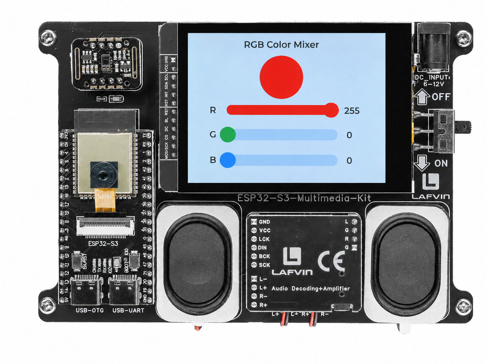

.. _lvgl_slider:

=================================
2.4 Slider — RGB Colour Mixer
=================================

Build a visual colour mixer with three sliders for real-time RGB control.

Overview
========

This example demonstrates LVGL slider widgets. Three independent sliders (R, G, B, each ranging from 0 to 255) control the colour of a circular preview object. As you drag any slider, the preview updates in real time — a responsive way to explore the full 24-bit colour space.

What You'll Learn
=================

* Creating and configuring sliders (``lv_slider``)
* Setting slider range, initial value, and visual style
* Creating a custom rounded object using ``LV_RADIUS_CIRCLE``
* Responding to ``LV_EVENT_VALUE_CHANGED`` events

Setup Notes
===========

Make sure you have already completed:

* :ref:`driver_install`
* :ref:`environment_setup`

Open the example sketch from the code package:

``LAFVIN-ESP32-S3-Multimedia-Kit-main/2.LVGL/04_LVGL_Slider/04_LVGL_Slider.ino``

This example uses only the display. No external wiring is required.

Upload and Test
===============

#. Connect the board with a USB Type-C data cable.
#. Open ``04_LVGL_Slider.ino`` in Arduino IDE.
#. In the **Tools** menu, select ``ESP32S3 Dev Module`` as the board and choose the correct serial port.
#. Click **Upload**.
#. The screen shows:

   * A large circular preview object at the top (starts white)
   * Three horizontal sliders labelled R, G, B, each with a numeric value display
   * Drag any slider — the preview circle changes colour instantly
   * Move all three sliders to mix any colour from the RGB palette

How the Code Works
==================

**Slider Setup**

.. code-block:: cpp

   lv_obj_t *slider_r = lv_slider_create(lv_scr_act());
   lv_slider_set_range(slider_r, 0, 255);
   lv_slider_set_value(slider_r, 255, LV_ANIM_OFF);  // Start at full

   // Colour the indicator bar and knob to match
   lv_obj_set_style_bg_color(slider_r,
       lv_palette_main(LV_PALETTE_RED), LV_PART_INDICATOR);
   lv_obj_set_style_bg_color(slider_r,
       lv_palette_main(LV_PALETTE_RED), LV_PART_KNOB);

**Circular Preview Object**

.. code-block:: cpp

   lv_obj_t *ball = lv_obj_create(lv_scr_act());
   lv_obj_set_size(ball, 80, 80);
   lv_obj_set_style_radius(ball, LV_RADIUS_CIRCLE, 0); // Make it round

**Live Colour Update**

.. code-block:: cpp

   static void slider_cb(lv_event_t *e) {
       int r = lv_slider_get_value(slider_r);
       int g = lv_slider_get_value(slider_g);
       int b = lv_slider_get_value(slider_b);

       lv_obj_set_style_bg_color(ball,
           lv_color_make(r, g, b), 0);
   }

In the provided sketch:

* Each slider starts at maximum (255), so the initial colour is white
* ``LV_ANIM_OFF`` skips the animation when setting the initial value
* ``lv_color_make()`` creates a 16-bit LVGL colour from 8-bit RGB values

Try This Next
=============

* Change the slider range to 0–100 for percentage-based control
* Add a fourth slider for overall brightness
* Connect the RGB values to the WS2812 LED as well (see :ref:`lvgl_gpio`)
