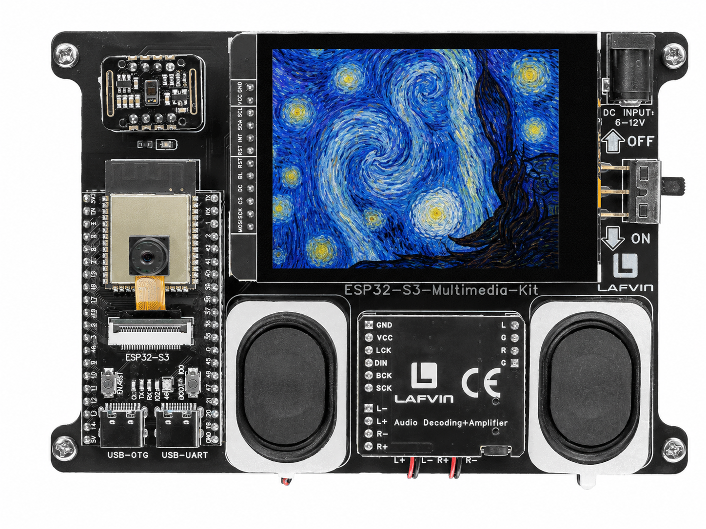

.. _lvgl_image:

===========================
2.5 Embedded Image Display
===========================

Display a full-screen bitmap image compiled directly into the firmware.

Overview
========

LVGL can display images stored as C arrays in program memory — no SD card required. This example shows a 240×320 painting embedded in the sketch, demonstrating how to convert and use static images for splash screens, icons, and backgrounds.

What You'll Learn
=================

* Converting images to LVGL-compatible C arrays with the `LVGL Image Converter <https://lvgl.io/tools/imageconverter>`_
* Creating an LVGL image object (``lv_img``)
* Using the ``lv_img_dsc_t`` image descriptor structure

Setup Notes
===========

Make sure you have already completed:

* :ref:`driver_install`
* :ref:`environment_setup`

Open the example sketch from the code package:

``LAFVIN-ESP32-S3-Multimedia-Kit-main/2.LVGL/05_LVGL_Image/05_LVGL_Image.ino``

This example uses only the display. No external wiring is required.

Upload and Test
===============

#. Connect the board with a USB Type-C data cable.
#. Open ``05_LVGL_Image.ino`` in Arduino IDE.
#. In the **Tools** menu, select ``ESP32S3 Dev Module`` as the board and choose the correct serial port.
#. Click **Upload**.
#. After uploading, the screen displays a 240×320 pixel "StarryNight" painting, with the caption **"StarryNight Image / 240x320 from C array"** at the bottom.

How the Code Works
==================

**Image Descriptor**

The image data lives in ``StarryNight.c``, which was generated by the online LVGL Image Converter. It defines two things:

.. code-block:: cpp

   // Raw pixel data (240 × 320 × 2 bytes for RGB565)
   const uint8_t starrynight_map[] = { ... };

   // Descriptor that tells LVGL how to interpret the data
   const lv_img_dsc_t StarryNight = {
       .header.cf = LV_IMG_CF_TRUE_COLOR,  // RGB565 format
       .header.w  = 240,
       .header.h  = 320,
       .data_size = 240 * 320 * 2,
       .data      = starrynight_map,
   };

**Displaying the Image**

.. code-block:: cpp

   lv_obj_t *img = lv_img_create(lv_scr_act());
   lv_img_set_src(img, &StarryNight);

In the provided sketch:

* The image is declared as ``extern`` in ``image_data.h``, included by the sketch
* The image fills the screen because 240×320 closely matches the display resolution
* ``lv_img_set_src()`` accepts a pointer to an ``lv_img_dsc_t``

Try This Next
=============

* Convert your own image using the `LVGL Image Converter <https://lvgl.io/tools/imageconverter>`_
* Use a smaller image (e.g., 64×64) as an icon for a button
* For dynamic images loaded from SD card, see :ref:`lvgl_gallery`
