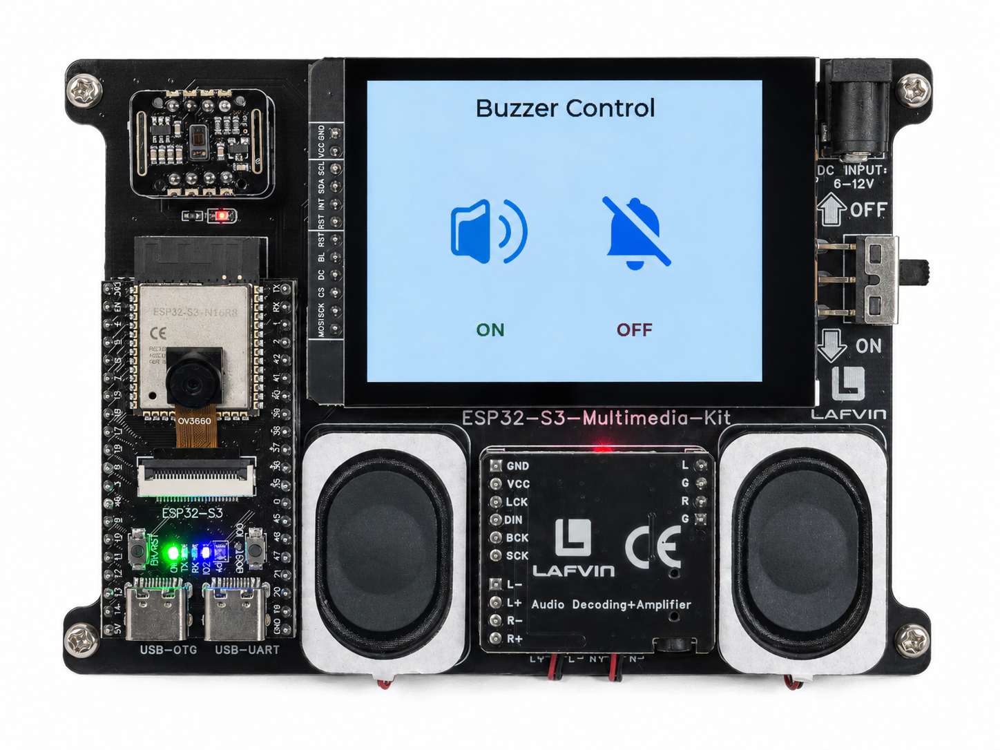

.. _lvgl_imgbtn:

====================================
2.6 Image Buttons — Buzzer Control
====================================

Use images as clickable buttons to turn the onboard buzzer on and off.

Overview
========

LVGL images can become interactive by adding the ``LV_OBJ_FLAG_CLICKABLE`` flag. This example uses two image icons — a buzzer symbol and a mute symbol — as buttons that control the buzzer on GPIO 45.

What You'll Learn
=================

* Making image objects clickable (an alternative to ``lv_imgbtn``)
* Controlling a passive buzzer with PWM via ``ledcWriteTone()``
* Using C-array images for button icons

Setup Notes
===========

Make sure you have already completed:

* :ref:`driver_install`
* :ref:`environment_setup`

Open the example sketch from the code package:

``LAFVIN-ESP32-S3-Multimedia-Kit-main/2.LVGL/06_LVGL_IMG_BTN/06_LVGL_IMG_BTN.ino``

This example uses the **onboard** buzzer. No external wiring is required.

======== ========
Signal   ESP32-S3
======== ========
BUZZER   GPIO 45
======== ========

Upload and Test
===============

#. Connect the board with a USB Type-C data cable.
#. Open ``06_LVGL_IMG_BTN.ino`` in Arduino IDE.
#. In the **Tools** menu, select ``ESP32S3 Dev Module`` as the board and choose the correct serial port.
#. Click **Upload**.
#. The screen shows two large image buttons:

   * Left: a **buzzer/speaker icon** with a green "ON" label
   * Right: a **mute icon** with a red "OFF" label

   Tap the buzzer icon — you should hear a continuous tone from the onboard buzzer. Tap the mute icon to stop it.

How the Code Works
==================

**Image as a Clickable Button**

.. code-block:: cpp

   #include "image_data.h"

   lv_obj_t *btn_buzzer = lv_img_create(lv_scr_act());
   lv_img_set_src(btn_buzzer, &buzzer_img);

   lv_obj_add_flag(btn_buzzer, LV_OBJ_FLAG_CLICKABLE);
   lv_obj_add_event_cb(btn_buzzer, buzzer_on_cb,
                       LV_EVENT_CLICKED, NULL);

**Passive Buzzer with PWM**

.. code-block:: cpp

   #define BUZZER_PIN 45

   void buzzerOn() {
       ledcAttach(BUZZER_PIN, 2000, 8);  // 2kHz, 8-bit resolution
       ledcWriteTone(0, 2000);           // Play 2kHz tone
   }

   void buzzerOff() {
       ledcWriteTone(0, 0);              // Stop the tone
   }

**Active Buzzer Mode**

The sketch also supports active (self-oscillating) buzzers:

.. code-block:: cpp

   #ifdef ACTIVE_BUZZER
       digitalWrite(BUZZER_PIN, HIGH);   // Active buzzer: HIGH = on
   #endif

In the provided sketch:

* The two image icons are compiled from C arrays, similar to :ref:`lvgl_image`
* ``LV_OBJ_FLAG_CLICKABLE`` makes any LVGL object respond to touch events
* ``ledcWriteTone()`` generates a clean frequency on the PWM channel

Try This Next
=============

* Change ``2000`` in ``ledcWriteTone()`` to a different frequency (e.g., 1000 or 4000)
* Try switching to active buzzer mode by defining ``ACTIVE_BUZZER``
* Add more image buttons with different tones (low / medium / high)
