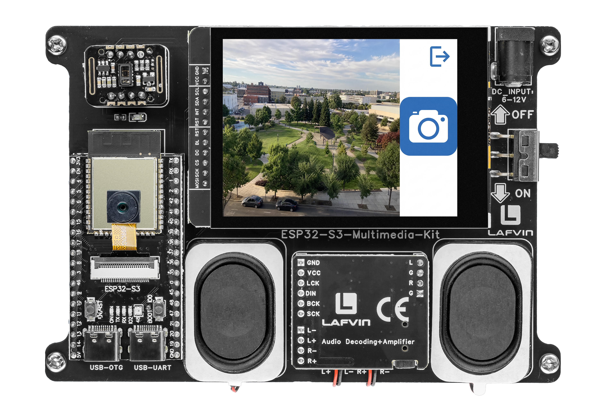

.. _lvgl_camera:

=======================================
2.7 Camera Live Preview and Capture
=======================================

Stream live camera video to the TFT screen and capture photos to the SD card.

Overview
========

This example turns the board into a handheld camera. It displays a live 240×240 viewfinder on the TFT screen, lets you capture photos as BMP files to the SD card with a single tap, and supports swipe gestures for mirroring and flipping the image.

What You'll Learn
=================

* Streaming camera frames to an LVGL image object in real time
* Using a FreeRTOS task for dedicated camera frame grabbing
* Double-buffering for tear-free display
* Saving BMP files to SD card
* Implementing swipe gesture detection

Setup Notes
===========

Make sure you have already completed:

* :ref:`driver_install`
* :ref:`environment_setup`

Open the example sketch from the code package:

``LAFVIN-ESP32-S3-Multimedia-Kit-main/2.LVGL/07_LVGL_Camera/07_LVGL_Camera.ino``

.. note::
   You need a Micro SD card formatted as **FAT32** inserted for photo capture.

Upload and Test
===============

#. Insert a FAT32-formatted Micro SD card.
#. Connect the board with a USB Type-C data cable.
#. Open ``07_LVGL_Camera.ino`` in Arduino IDE.
#. In the **Tools** menu, select ``ESP32S3 Dev Module`` as the board and choose the correct serial port.
#. Click **Upload**.
#. After uploading, you see a live 240×240 camera preview on the left side of the screen.

   * Tap the **camera icon** (right side, 80×80) to capture a BMP photo to ``/picture/`` on the SD card
   * **Swipe left or right** to toggle horizontal mirror
   * **Swipe up or down** to toggle vertical flip
   * Tap the **exit icon** (top-right corner) to return (used in the All-In-One launcher)

How the Code Works
==================

The camera logic is mainly implemented in ``camera_ui.cpp`` (preview, capture, gestures) and ``camera.cpp`` (sensor initialisation and mirror/flip control).

**Camera Initialisation**

The ``camera_init()`` function configures the sensor with a designated initialiser list covering all pins, the XCLK frequency (10 MHz), pixel format (RGB565), and frame size (240×240). After initialisation it reads back the sensor handle to set brightness, saturation, and the initial mirror/flip state.

.. code-block:: cpp

     camera_config_t config = {
       .pin_pwdn = PWDN_GPIO_NUM,
       .pin_reset = RESET_GPIO_NUM,
       .pin_xclk = XCLK_GPIO_NUM,
       .pin_sccb_sda = SIOD_GPIO_NUM,
       .pin_sccb_scl = SIOC_GPIO_NUM,

       .pin_d7 = Y9_GPIO_NUM,
       .pin_d6 = Y8_GPIO_NUM,
       .pin_d5 = Y7_GPIO_NUM,
       .pin_d4 = Y6_GPIO_NUM,
       .pin_d3 = Y5_GPIO_NUM,
       .pin_d2 = Y4_GPIO_NUM,
       .pin_d1 = Y3_GPIO_NUM,
       .pin_d0 = Y2_GPIO_NUM,

       .pin_vsync = VSYNC_GPIO_NUM,
       .pin_href = HREF_GPIO_NUM,
       .pin_pclk = PCLK_GPIO_NUM,

       .xclk_freq_hz = CAMERA_XCLK_FREQ,
       .ledc_timer = LEDC_TIMER_0,
       .ledc_channel = LEDC_CHANNEL_0,

       .pixel_format = CAMERA_PIXEL_FORMAT,
       .frame_size = CAMERA_FRAME_SIZE,

       .jpeg_quality = CAMERA_JPEG_QUALITY,
       .fb_count = CAMERA_FB_COUNT,
       .fb_location = CAMERA_FB_LOCATION,
       .grab_mode = CAMERA_GRAB_LATEST
     };

     esp_err_t err = esp_camera_init(&config);

**FreeRTOS Preview Task**

A dedicated FreeRTOS task grabs frames from the camera and copies them into a double-buffer. RGB565 byte order is swapped during the copy because the camera and LVGL use opposite endianness for 16-bit colour.

.. code-block:: cpp

   void camera_task_loop(void *pvParameters) {
     while (s_task_running) {
       camera_fb_t *frame = esp_camera_fb_get();
       if (frame != NULL && frame->buf != NULL) {
         int display_index = 0;
         taskENTER_CRITICAL(&s_preview_lock);
         display_index = s_display_buffer_index;
         taskEXIT_CRITICAL(&s_preview_lock);

         const int write_index = 1 - display_index;
         camera_copy_rgb565_for_display(frame, s_preview_buffers[write_index]);

         taskENTER_CRITICAL(&s_preview_lock);
         s_ready_buffer_index = write_index;
         s_frame_ready = true;
         taskEXIT_CRITICAL(&s_preview_lock);

         esp_camera_fb_return(frame);
       }

       vTaskDelay(pdMS_TO_TICKS(CAMERA_PREVIEW_FRAME_INTERVAL_MS));
     }
     // ... task cleanup ...
     vTaskDelete(NULL);
   }

Two heap-allocated buffers are used — ``s_preview_buffers[0]`` and ``s_preview_buffers[1]`` — allocated from PSRAM (falling back to internal RAM). The ``s_preview_lock`` spinlock protects the buffer index and ready flag from concurrent access.

**Double-Buffered Display Refresh**

The main loop calls ``camera_ui_refresh_preview()``, which swaps the buffers under the same critical section. This keeps the display smooth while the task writes to the other buffer.

.. code-block:: cpp

   void camera_ui_refresh_preview(void) {
     int ready_index = -1;

     taskENTER_CRITICAL(&s_preview_lock);
     if (s_frame_ready) {
       ready_index = s_ready_buffer_index;
       s_display_buffer_index = ready_index;
       s_frame_ready = false;
     }
     taskEXIT_CRITICAL(&s_preview_lock);

     if (ready_index < 0 || ready_index > 1 || g_camera_ui.video_preview == NULL) {
       return;
     }

     g_photo_display.data = s_preview_buffers[ready_index];
     lv_obj_invalidate(g_camera_ui.video_preview);
   }

The ``lv_img_dsc_t`` descriptor (``g_photo_display``) is initialised once and reused — only its ``.data`` pointer is updated each frame.

**Photo Capture**

When the camera icon is tapped, the preview task is stopped, a fresh frame is grabbed directly from the sensor, its byte order is swapped, and it is written as a BMP to ``/picture/N.bmp`` on the SD card. The preview task is then restarted.

.. code-block:: cpp

   static void on_photo_button_clicked(lv_event_t *event) {
     if (lv_event_get_code(event) != LV_EVENT_CLICKED) {
       return;
     }

     if (s_task_running) {
       if (!camera_task_stop()) {
         return;
       }
     }

     camera_fb_t *frame = esp_camera_fb_get();
     if (frame != NULL && frame->buf != NULL) {
       camera_swap_rgb565_bytes(frame->buf, frame->len);

       int photo_index = list_count_number(list_picture);
       if (photo_index != -1) {
         String file_path = String(PICTURE_FOLDER) + "/" + String(++photo_index) + ".bmp";
         write_rgb565_to_bmp(
           (char *)file_path.c_str(),
           frame->buf,
           frame->len,
           frame->height,
           frame->width
         );
         list_insert_tail(list_picture, (char *)file_path.c_str());
       }

       esp_camera_fb_return(frame);
     }

     camera_task_start();
   }

**Gesture Controls**

Swipe gestures on the screen toggle the sensor's horizontal mirror and vertical flip settings. ``lv_indev_get_gesture_dir()`` returns the swipe direction as an ``LV_DIR_*`` constant.

.. code-block:: cpp

   static void on_screen_gesture(lv_event_t *event) {
     if (lv_event_get_code(event) != LV_EVENT_GESTURE) {
       return;
     }

     const lv_dir_t direction = lv_indev_get_gesture_dir(lv_indev_get_act());

     switch (direction) {
       case LV_DIR_LEFT:
       case LV_DIR_RIGHT:
         camera_set_mirror_horizontal(!camera_get_mirror_horizontal());
         break;

       case LV_DIR_TOP:
       case LV_DIR_BOTTOM:
         camera_set_flip_vertical(!camera_get_flip_vertical());
         break;

       default:
         break;
     }
   }

In the provided sketch:

* The snapshot button (80×80 px) is positioned to the right of the 240×240 preview, using an embedded camera icon image
* A linked list (``list_picture``) tracks captured photos so the gallery in :ref:`lvgl_gallery` can display them
* The preview task stack is ``CAMERA_TASK_STACK_SIZE`` bytes and is created on ``xTaskCreate`` with ``CAMERA_TASK_PRIORITY``

Try This Next
=============

* Change capture resolution by editing the camera config
* Add a timestamp to the saved filename using ``millis()``
* Increase the preview frame rate by reducing ``vTaskDelay()``
