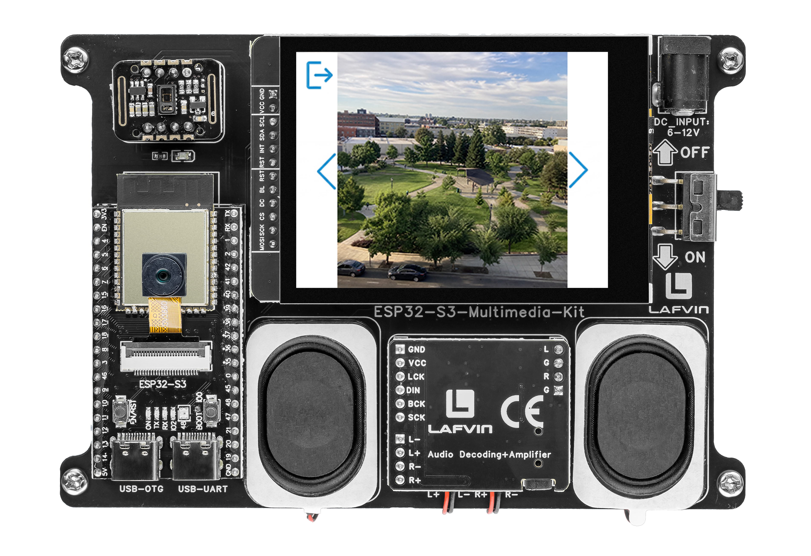

.. _lvgl_gallery:

==============================
2.8 SD Card Photo Gallery
==============================

Browse and display BMP images stored on the SD card with a touch-friendly photo gallery.

Overview
========

This example creates a photo viewer application. It scans the SD card's ``/picture/`` folder for BMP images, builds a navigation list, and lets you browse through photos with left/right arrow buttons.

.. 告诉用户可以在2.7摄像头项目中拍照,照片会自动保存在/picture/文件夹里,然后在这个相册里查看

What You'll Learn
=================

* Scanning a directory for specific file types
* Building a list of file paths in memory
* Loading and displaying BMP images from the SD card
* Implementing gallery-style navigation (previous, next, Back)

Setup Notes
===========

Make sure you have already completed:

* :ref:`driver_install`
* :ref:`environment_setup`

Open the example sketch from the code package:

``LAFVIN-ESP32-S3-Multimedia-Kit-main/2.LVGL/08_LVGL_Gallery/08_LVGL_Gallery.ino``

.. note::
   Before uploading, create a ``/picture/`` folder on your SD card and place some 240×240 BMP images inside. The photos you captured in :ref:`lvgl_camera` will appear here automatically.

Upload and Test
===============

#. Insert a Micro SD card with BMP images in the ``/picture/`` folder.
#. Connect the board with a USB Type-C data cable.
#. Open ``08_LVGL_Gallery.ino`` in Arduino IDE.
#. In the **Tools** menu, select ``ESP32S3 Dev Module`` as the board and choose the correct serial port.
#. Click **Upload**.
#. After uploading:

   * The first photo from ``/picture/`` is displayed
   * Tap the **right arrow** to view the next photo
   * Tap the **left arrow** to view the previous photo
   * Tap the **home icon** (top-left corner) to return

How the Code Works
==================

The gallery logic is mainly implemented in ``picture_ui.cpp``.

**BMP Loading from SD**

Rather than relying on LVGL's built-in BMP decoder, the gallery includes a custom ``load_bmp_from_sd()`` function that parses the BMP header, validates the format (16-bit RGB565, 240×240, BI_RGB or BI_BITFIELDS compression), and reads each row into a reusable pixel buffer. The function supports both top-down and bottom-up row ordering.

.. code-block:: cpp

   static bool load_bmp_from_sd(const char *name) {
     if (name == NULL || !picture_buffer_init()) {
       return false;
     }

     String file_path = String("/picture/") + name;
     File file = SD_MMC.open(file_path.c_str(), FILE_READ);
     if (!file) {
       return false;
     }

     const uint16_t signature = read_u16_le(file);
     if (signature != 0x4D42) {
       file.close();
       return false;
     }

     // ... read header fields: data_offset, width, height, bit_count, compression ...

     if (header_size < 40 || planes != 1 || bit_count != 16) {
       file.close();
       return false;
     }

     if (width != 240 || (height != 240 && height != -240)) {
       file.close();
       return false;
     }

     const bool bottom_up = (height > 0);
     const uint32_t row_size = 240 * 2;
     uint8_t row_buffer[row_size];

     for (int row = 0; row < 240; ++row) {
       const uint32_t bmp_row = bottom_up ? (239 - row) : row;
       if (!file.seek(data_offset + bmp_row * row_size)) {
         file.close();
         return false;
       }

       const size_t read_len = file.read(row_buffer, row_size);
       if (read_len != row_size) {
         file.close();
         return false;
       }

       memcpy(s_bmp_pixels + row * row_size, row_buffer, row_size);
     }

     file.close();
     return true;
   }

Each row is read individually via ``file.seek()`` and ``file.read()``, avoiding the need for a full-file buffer.

**Image Buffer Management**

A single 240×240×2 byte buffer (``s_bmp_pixels``) is allocated once from PSRAM (falling back to internal RAM). The buffer is wrapped in a static ``lv_img_dsc_t`` descriptor (``s_bmp_img_dsc``) that is reused for every displayed image.

.. code-block:: cpp

   static bool picture_buffer_init() {
     if (s_bmp_pixels != NULL) {
       return true;
     }

     const size_t image_size = 240 * 240 * 2;
     s_bmp_pixels = (uint8_t *)heap_caps_malloc(image_size, MALLOC_CAP_SPIRAM | MALLOC_CAP_8BIT);
     if (s_bmp_pixels == NULL) {
       s_bmp_pixels = (uint8_t *)heap_caps_malloc(image_size, MALLOC_CAP_8BIT);
     }
     // ... null check ...

     s_bmp_img_dsc.header.cf = LV_IMG_CF_TRUE_COLOR;
     s_bmp_img_dsc.header.w = 240;
     s_bmp_img_dsc.header.h = 240;
     s_bmp_img_dsc.data_size = image_size;
     s_bmp_img_dsc.data = s_bmp_pixels;
     s_bmp_ready = true;
     return true;
   }

The ``picture_imgbtn_display()`` function orchestrates the pipeline: it calls ``load_bmp_from_sd()``, then sets the descriptor as the image source and invalidates the display object.

**Navigation with Wrap-Around**

The left and right arrow buttons increment or decrement a 1-based index (``picture_index_num``). When the index goes below 1 it wraps to the last photo; when it exceeds the count it wraps to the first.

.. code-block:: cpp

   static void picture_imgbtn_left_event_handler(lv_event_t *e) {
     if (lv_event_get_code(e) == LV_EVENT_CLICKED) {
       picture_index_num--;
       if (picture_index_num < 1) {
         picture_index_num = list_count_number(list_picture);
       }
       picture_imgbtn_display(list_find_node(list_picture, picture_index_num));
     }
   }

   static void picture_imgbtn_right_event_handler(lv_event_t *e) {
     if (lv_event_get_code(e) == LV_EVENT_CLICKED) {
       picture_index_num++;
       if (picture_index_num > list_count_number(list_picture)) {
         picture_index_num = 1;
       }
       picture_imgbtn_display(list_find_node(list_picture, picture_index_num));
     }
   }

In the provided sketch:

* File paths are stored in a linked list (``list_picture``) populated by ``setup_list_head_picture()``, which scans ``/picture/`` for ``.bmp`` files
* The home button (top-left) and left/right arrow buttons use ``lv_imgbtn`` with transparent backgrounds — only the icon images are visible
* Navigation buttons are 60×60 px and positioned at the left and right edges of the screen

Try This Next
=============

* Add a "slideshow" mode that auto-advances every few seconds
* Display the filename or image number at the bottom of the screen
* Sort the photos alphabetically or by file date
