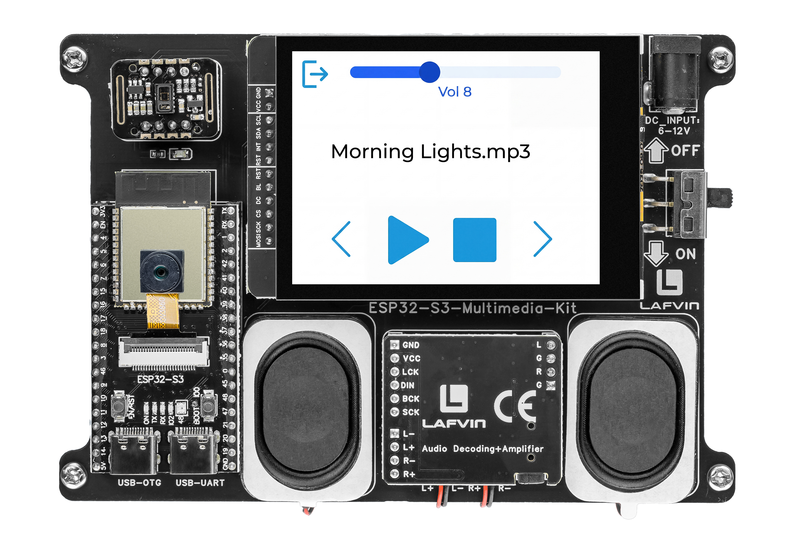

.. _lvgl_music:

========================
2.9 MP3 Music Player
========================

A full-featured music player with playback controls and volume adjustment.

Overview
========

This example creates a complete music player UI. It scans the SD card's ``/music/`` folder for MP3 files, displays the current track title, and provides play/pause, stop, skip, and volume controls — all driven by the touchscreen.

What You'll Learn
=================

* Scanning an SD card for MP3 files
* Building a music player UI with transport buttons
* Integrating I2S audio playback with LVGL state management
* Using a slider widget for volume control

Setup Notes
===========

Make sure you have already completed:

* :ref:`driver_install`
* :ref:`environment_setup`

Open the example sketch from the code package:

``LAFVIN-ESP32-S3-Multimedia-Kit-main/2.LVGL/09_LVGL_Music/09_LVGL_Music.ino``

.. note::
   Before uploading, create a ``/music/`` folder on your SD card and copy one or more MP3 files into it.

=========== ========
Signal      ESP32-S3
=========== ========
I2S BCLK    GPIO 42
I2S LRC     GPIO 14
I2S DOUT    GPIO 41
SD CMD      GPIO 38
SD CLK      GPIO 39
SD D0       GPIO 40
=========== ========

Upload and Test
===============

#. Insert a Micro SD card with MP3 files in the ``/music/`` folder.
#. Connect the board with a USB Type-C data cable.
#. Open ``09_LVGL_Music.ino`` in Arduino IDE.
#. In the **Tools** menu, select ``ESP32S3 Dev Module`` as the board and choose the correct serial port.
#. Click **Upload**.
#. The music player screen shows:

   * The current track title at the top
   * Transport buttons: **prev**, **play/pause**, **stop**, **next**
   * A volume slider with numeric readout

   The player automatically begins playing the first MP3 file it finds. Use the touchscreen to control playback.

How the Code Works
==================

The music player logic is mainly implemented in ``music_ui.cpp``.

**Track Loading**

The ``music_ui_prepare_first_track()`` function scans the linked list populated from ``/music/`` and primes the title label with the first filename without auto-playing it. When the user taps play, ``music_ui_play_index()`` constructs the full SD path and calls ``s_audio.connecttoFS()`` to start decoding.

.. code-block:: cpp

   static bool music_ui_play_index(int index) {
     if (s_music_count <= 0) {
       s_track_loaded = false;
       s_music_paused = false;
       music_ui_set_title_text(NULL);
       music_ui_refresh_controls();
       return false;
     }

     if (index < 1) {
       index = s_music_count;
     } else if (index > s_music_count) {
       index = 1;
     }

     char *file_name = list_find_node(list_music, index);
     if (file_name == NULL) {
       return false;
     }

     s_audio.stopSong();

     String file_path = String(MUSIC_FOLDER) + "/" + file_name;
     s_audio.connecttoFS(SD_MMC, file_path.c_str());
     s_music_index = index;
     s_track_loaded = true;
     s_music_paused = false;

     music_ui_set_title_text(file_name);
     music_ui_refresh_controls();
     return true;
   }

The index is 1-based and wraps around at both ends — going below 1 wraps to ``s_music_count``, and exceeding ``s_music_count`` wraps to 1.

**Play/Pause & Transport Controls**

The ``music_ui_toggle_play_pause()`` function implements a three-state toggle: if no track is loaded it starts the current index, otherwise it calls ``s_audio.pauseResume()`` and flips the ``s_music_paused`` flag. The middle button icon swaps between play and pause symbols accordingly.

.. code-block:: cpp

   static void music_ui_toggle_play_pause() {
     if (s_music_count <= 0) {
       return;
     }

     if (!s_track_loaded) {
       music_ui_play_index(s_music_index > 0 ? s_music_index : 1);
       return;
     }

     s_audio.pauseResume();
     s_music_paused = !s_music_paused;
     music_ui_refresh_controls();
   }

The previous (``music_ui_play_previous``) and next (``music_ui_play_next``) functions decrement or increment the index with wrap-around, then call ``music_ui_play_index()``. The stop button calls ``music_ui_stop_current()``, which invokes ``s_audio.stopSong()`` and resets ``s_track_loaded``.

**Volume Control**

The volume slider ranges from 0 to 21 and updates the ``Audio`` library in real time. A numeric label below the slider shows the current value.

.. code-block:: cpp

     lv_slider_set_range(ui->volume_slider, 0, 21);
     lv_slider_set_value(ui->volume_slider, kDefaultVolume, LV_ANIM_OFF);

   static void on_volume_slider_changed(lv_event_t *event) {
     if (lv_event_get_code(event) != LV_EVENT_VALUE_CHANGED) {
       return;
     }

     int volume = lv_slider_get_value(g_music_ui.volume_slider);
     s_audio.setVolume(volume);
     music_ui_update_volume_label(volume);
   }

**Audio Loop & Auto-Advance**

The ``music_ui_loop()`` function, called from the sketch's ``loop()``, feeds the audio decoder with ``s_audio.loop()`` on every iteration. When a track reaches its end, the ``audio_eof_mp3()`` callback sets ``s_play_next_pending = true``, and the loop advances to the next track outside the audio callback context.

.. code-block:: cpp

   void music_ui_loop(void) {
     s_audio.loop();

     if (s_play_next_pending) {
       s_play_next_pending = false;
       music_ui_play_next();
     }
   }

   void audio_eof_mp3(const char *info) {
     Serial.print("eof_mp3     ");
     Serial.println(info);
     s_play_next_pending = true;
   }

In the provided sketch:

* The ``Audio`` library is initialised with I2S pinout (BCLK=42, LRC=14, DOUT=41) in ``music_ui_audio_init()``
* Transport buttons are ``lv_img`` objects with transparent backgrounds — only the icon images are visible
* ``music_ui_refresh_controls()`` enables or dims all transport buttons based on whether ``s_music_count > 0``

Try This Next
=============

* Add more MP3 files to the ``/music/`` folder and see the track list grow
* Display the track duration or current playback position
* Add a shuffle or repeat mode button
